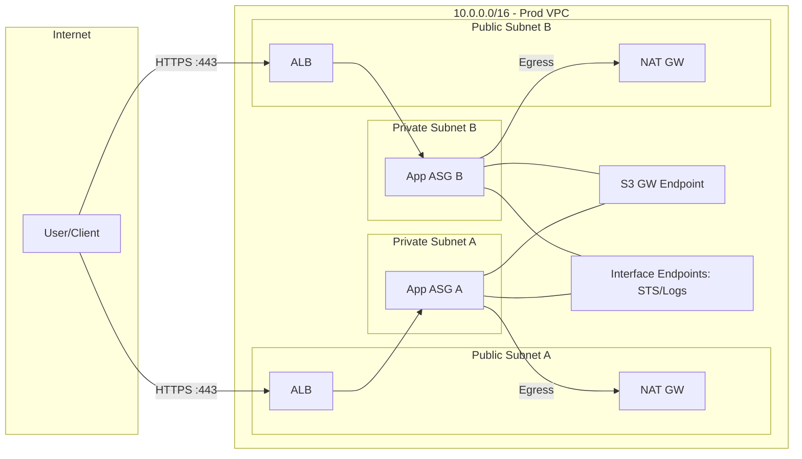
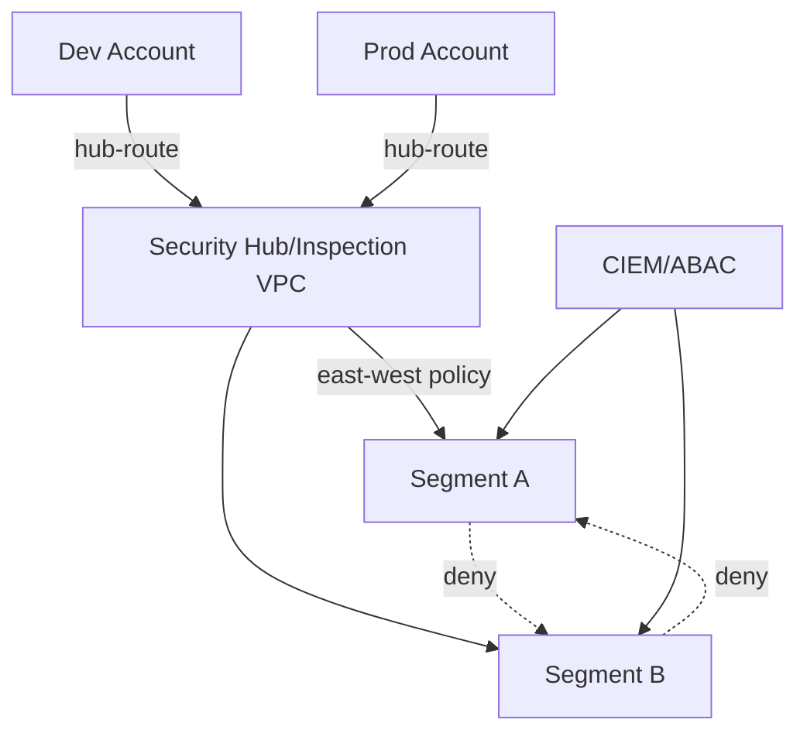

# Secure Network Architecture — Hands‑On Course (AWS-first, Multi‑Cloud Mindset)

Welcome! This repo is a **hands‑on + theory + analogy** course where we *design and build a secure network architecture* step‑by‑step, then iterate to a second design. We’ll commit everything to Git as we go.

> **Analogy (City & Districts):** Imagine your cloud as a **city**. A **VPC** is the city boundary. **Subnets** are districts (residential, industrial). **Route tables** are road maps. **Firewalls/NACLs/Security Groups** are gates & guard posts. **Transit Gateway** is your central interchange. **IAM** are the ID checks at every door. **Zero‑Trust** means every door re‑checks IDs—no “once inside, full access.”

## What you’ll build (Architecture 1 — AWS foundation)
- 1 VPC (10.0.0.0/16) with **public** and **private** subnets across **2 AZs**
- **NAT Gateway** for egress from private subnets
- **ALB** in public subnets fronting a demo web app in private subnets
- **Security Groups** with least privilege (no 0.0.0.0/0 to private)
- **NACLs** to block common bad ports at subnet borders
- **VPC Endpoints** (S3, STS, CloudWatch) for private access to AWS services
- **Centralized logging**: VPC Flow Logs + ALB logs + CloudTrail → S3 + CloudWatch Logs
- **KMS CMKs** for encryption at‑rest; TLS 1.2+ in transit
- **IAM**: break‑glass admin, least privilege roles, session tagging, access analyzer

> Later, we’ll extend to **Architecture 2** (Zero‑Trust Segmentation & Multi‑Account) and **Architecture 3** (Hybrid with Direct Connect & Palo Alto/Azure/GCP patterns).

## Diagrams (Mermaid)

### High‑Level AWS VPC


### Zero‑Trust Segmentation (Preview)


## How to use this course
1. **Clone** or download this repo and `cd` into it.
2. Work through labs in `./labs` sequentially.
3. Use Git after each checkpoint (commands below).
4. Open `./docs/architecture.md` while you build—keep it honest with what you actually deployed.
5. Extend to Architecture 2 once Architecture 1 passes tests.

### Git quickstart
```bash
# initialize and commit locally
git init
git add .
git commit -m "chore: scaffold course and Architecture 1 plan"

# create a new repo on GitHub first (empty), then:
git branch -M main
git remote add origin <YOUR_GITHUB_SSH_OR_HTTPS_URL>
git push -u origin main
```

### Tooling assumptions
- AWS account with admin (for lab), later reduce to least privilege
- AWS CLI v2 configured (`aws configure sso` or access keys)
- Terraform (>=1.6) optional for IaC labs
- jq, bash, and make

---

### Curriculum
- **Lab 01 – Foundation (VPC, subnets, routes, SG, NACL, NAT, ALB, endpoints)**  
- **Lab 02 – Zero‑Trust Segmentation (multi‑account, SCPs, TGW, GWLB/NGFW)**  
- **Lab 03 – Centralized Logging & Detection (CloudTrail, VPC Flow Logs, alarms, detections)**  

Each lab contains: **Objectives → Diagram → Steps → Checks → Cleanup**.

---

### Success criteria (Architecture 1)
- Private subnets have **no inbound from internet**.
- Egress from private goes **only via NAT**, restricted by SG + route tables.
- **ALB** terminates TLS; app nodes never public.
- **Endpoints** remove need for public internet to reach AWS APIs.
- **Logs** prove intended flows; alarms on deviations.
- **IAM**: no human long‑lived keys; MFA enforced.

Happy building! Commit early, commit often.
