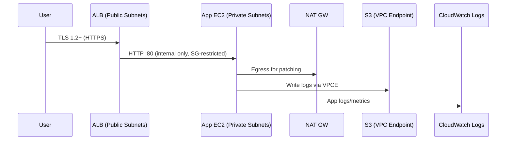

# Architecture 1 — AWS Foundation (Document As You Build)

## Goals
- Resilient, least-privilege network perimeter
- Private workloads reachable only via ALB
- Centralized logging and encryption everywhere

## Address Space
- VPC CIDR: `10.0.0.0/16`
- AZs: `us-east-1a`, `us-east-1b` (adjust to your region)
- Subnets:
  - Public A: `10.0.0.0/24`
  - Public B: `10.0.1.0/24`
  - Private A: `10.0.10.0/24`
  - Private B: `10.0.11.0/24`

## Security Controls
- SGs: ALB allows :443 from internet; App SG allows :80 from ALB SG only
- NACLs: Deny known bad ports; allow ephemeral response
- IAM: SSO or MFA; break-glass role; session duration <= 1h for admins
- KMS: CMKs for EBS/S3/ALB logs

## Mermaid — Data Flow

## Threat Model (STRIDE highlights)
- **Spoofing**: Enforce IAM MFA, endpoint policies, ALB TLS, SG source restrictions
- **Tampering**: KMS encryption; S3 Object Lock for logs
- **Repudiation**: CloudTrail org‑trail, S3 access logs
- **Information Disclosure**: No public IP on app nodes; SG/NACL; TLS everywhere
- **DoS**: ALB + AWS WAF (optional); SG rate limits (via NLB/WAF)
- **Elevation of Privilege**: CIEM/ABAC; no wildcard `*` in policies

## Acceptance Tests
- `curl -vk https://<ALB-DNS>` returns app page
- `aws logs filter-log-events` shows app/flow logs for request
- No instance has a public IP; `curl -4 ifconfig.me` from app goes via NAT
